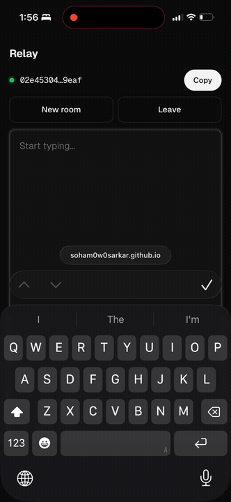
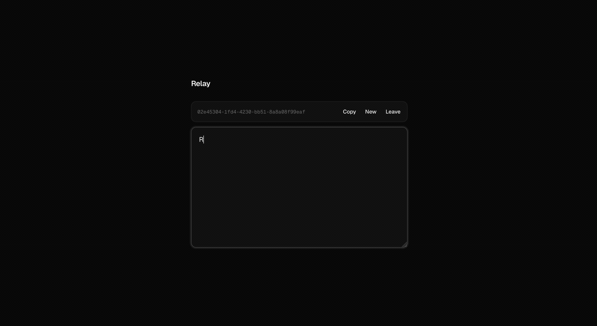

# Weavo
<p align="center">
  
</p>

> Tiny, framework-agnostic real-time collaborative text editing.

<p align="center">
  
  
</p>
<p align="center"><sub>Mobile · Desktop — same room, live sync</sub></p>

---

Weavo turns any native `<textarea>` into a collaborative editor with a single function call.

No CRDT knowledge. No editor framework. No React dependency. Just bind a textarea, connect to a room, and every participant stays in sync.

**Demo:** https://soham0w0sarkar.github.io/Weavo/

---

## Features

- Bind any native `HTMLTextAreaElement`
- Automatic real-time synchronization
- Conflict-free concurrent editing
- Cursor/selection preservation during remote edits
- Tiny, dependency-light client
- Works with any compatible Weavo WebSocket server
- Framework agnostic (React, Vue, Svelte, Solid, Vanilla JS...)

---

## Installation

```bash
npm install @weavo/client
```

or

```bash
pnpm add @weavo/client
```

or

```bash
bun add @weavo/client
```

---

## Quick Start

Weavo needs a **WebSocket relay** and the **browser client**. The server just forwards JSON — clients handle merging.

### 1. WebSocket server

```bash
npm install ws
```

```js
// server.js — node server.js
const { WebSocketServer } = require("ws");

const wss = new WebSocketServer({ port: 8080 });

wss.on("connection", (ws) => {
  ws.on("message", (data) => {
    for (const client of wss.clients) {
      if (client !== ws && client.readyState === 1) client.send(data);
    }
  });
});

console.log("ws://localhost:8080");
```

### 2. Browser client

```bash
npm install @weavo/client
```

```ts
import { createWeavo } from "@weavo/client";

const weavo = createWeavo("ws://localhost:8080");

const textarea = document.querySelector("textarea")!;
const dispose = weavo.bind(textarea);
```

That's it — open two tabs and start typing. Use `wss://` in production.

---

## API

### `createWeavo(urlOrTransport, options?)`

Creates a Weavo document.

```ts
const weavo = createWeavo("wss://localhost:8080?room=notes");
```

You may also pass a custom transport instead of a URL, plus optional persistence hooks:

```ts
const weavo = createWeavo(url, {
  initial: { snapshot, delta }, // restore from storage
  onOp(op) { /* append to delta log */ },
});
```

---

### `weavo.bind(textarea)`

Binds a native textarea to the collaborative document.

```ts
const cleanup = weavo.bind(textarea);
```

Returns a cleanup function.

```ts
cleanup();
```

---

### `weavo.textSubscribe(listener)`

Listen for document text changes.

```ts
const unsubscribe = weavo.textSubscribe((change) => {
  console.log(change); // { index: 3, insert: "a" } or { index: 1, delete: 2 }
});
```

Useful for analytics, live previews, and custom UI updates.

---

### `weavo.snapshot()` — persistence

Capture a JSON checkpoint of the document (CRDT state + state vector):

```ts
const checkpoint = weavo.snapshot();
localStorage.setItem("doc:snapshot", JSON.stringify(checkpoint));
localStorage.setItem("doc:delta", "[]");
```

Restore on the next visit with **base + delta**:

1. Save `weavo.snapshot()` as the base checkpoint.
2. Append every operation via `onOp` to a delta array.
3. Pass `initial: { snapshot, delta }` to `createWeavo`.

`DocumentSnapshot` is plain JSON — use any database or file store. See [`packages/client/README.md`](./packages/client/README.md) for a full localStorage example.

## How it Works

Weavo observes browser input events, converts them into editing operations, synchronizes those operations over WebSockets, and automatically applies incoming changes while preserving the user's current cursor and selection whenever possible.

From the application's perspective, it's simply:

```
User Input
      ↓
Weavo
      ↓
WebSocket
      ↓
Everyone Else
```

No manual diffing.

No reconciliation logic.

No polling.

---

## Framework Example

### React

```tsx
const weavo = createWeavo(url);

useEffect(() => {
  if (!ref.current) return;
  return weavo.bind(ref.current);
}, []);
```

Because Weavo works directly with the DOM, it can be used with virtually any frontend framework.

---

## Browser Support

Modern browsers supporting:

- WebSocket
- beforeinput events
- HTMLTextAreaElement
- ES Modules

---

## Philosophy

Weavo intentionally focuses on one thing:

> Make collaborative textareas ridiculously simple.

It does **not** attempt to become:

- a rich text editor
- an editor framework
- a UI toolkit

Instead, Weavo provides a reliable synchronization layer that can be integrated anywhere.

---

## Packages

This repository is a monorepo containing:

| Package            | Description                  |
| ------------------ | ---------------------------- |
| `@weavo/client`    | Browser client               |
| `@weavo/core`      | Collaborative editing engine |
| `@weavo/sync`      | Synchronization protocol     |
| `@weavo/transport` | Transport abstraction        |

---

## Development

```bash
bun install

bun run dev
```

Build all packages:

```bash
bun run build
```

Run the demo:

```bash
bun run dev
```

---

## License

MIT
