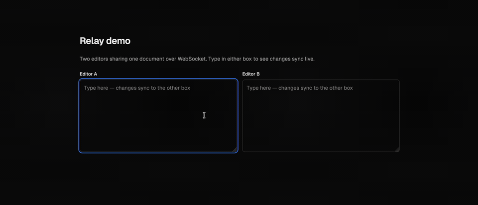

# Relay

> A deterministic, CRDT-based collaboration engine with fast indexing and a minimal API.



---

## ✨ Overview

Relay is a modular, operation-based collaboration system designed for building real-time editors.

It is built around a simple idea:

```
state + operation → new state
```

Relay focuses on:

* **Deterministic CRDT merging**
* **Efficient text indexing (skip list)**
* **Minimal public API**
* **Layered, extensible architecture**

---

## 🧠 Core Philosophy

Relay treats collaboration as a **state machine**:

* The document is just **data**
* Changes are expressed as **operations**
* The system evolves via **pure transitions**

```
Document = state
apply()   = transition
getText() = projection
```

---

## 🔥 Features

* ⚡ Operation-based CRDT (no OT)
* 🔁 Deterministic conflict resolution
* 📦 Minimal API surface
* 🚀 O(log n) indexing via skip list
* 🪦 Tombstone-based deletion
* 🔌 Transport-agnostic sync layer
* 🧩 Editor-agnostic core

---

## 📦 Monorepo Structure

```
relay/
├── apps/
│   ├── demo/
│   └── playground/
│
├── packages/
│   ├── core/        → CRDT engine
│   ├── sync/        → replica coordination
│   ├── transport/   → networking
│   ├── presence/    → cursors, awareness
│   └── react/       → UI bindings
```

---

## 🏗️ Architecture

```
Editor UI
   ↓
React bindings
   ↓
Presence
   ↓
Transport
   ↓
Sync
   ↓
Core (CRDT engine)
```

### Layer Responsibilities

| Layer     | Responsibility                  |
| --------- | ------------------------------- |
| core      | State + operations (CRDT logic) |
| sync      | Replica reconciliation          |
| transport | Message delivery                |
| presence  | Ephemeral user state            |
| react     | UI integration                  |

---

## 🧩 Core API

Relay intentionally exposes a **minimal API**:

```ts
createDocument()
apply(doc, operation)
getText(doc)
```

### Example

```ts
const doc = createDocument()

const next = apply(doc, {
  type: "insert",
  position: 0,
  content: "H"
})

console.log(getText(next)) // "H"
```

---

## 🧠 Data Model

### CRDT Node (source of truth)

```
{
  id: (clientId, clock)
  content: string
  deleted: boolean
}
```

* Globally unique
* Deterministically ordered
* Never physically removed (tombstones)

---

### Skip List (index layer)

```
{
  ref → CRDT node
  next[]
  span[]
}
```

* Used for fast index lookup
* Not synced across peers
* Rebuilt locally
* Level 0 = visible ordering

---

## ⚠️ Important Design Rules

### 1. Identity is CRDT-owned

```
id = (clientId, clock)
```

Skip list nodes **must not introduce new IDs**.

---

### 2. Skip list is an index, not storage

* CRDT = truth
* Skip list = performance layer

---

### 3. Deletes are tombstones

```
node.deleted = true
```

* Nodes are not removed
* Index spans are adjusted instead

---

### 4. Operations are the only source of change

```
No direct mutation
Only apply(operation)
```

---

## ✍️ Input Handling

User input (e.g. `<textarea>` or editor) produces:

```
InputEvent → Operation → apply()
```

Example:

```ts
{
  type: "insert",
  position: 5,
  content: "a"
}
```

---

## ⚡ Performance

Relay treats performance as a first-class concern.

### Indexing

* Skip list with spans
* Enables:

  * index → node lookup in **O(log n)**
  * fast insert/delete

### CRDT Optimizations (inspired by Yjs)

* Merge adjacent inserts
* Remove content from deleted nodes
* Optional garbage collection of tombstones

---

## 🔄 Sync Model

Relay uses an operation-based sync protocol.

### State Vector

```
clientId → clock
```

Used to:

* determine missing operations
* sync efficiently between peers

---

## 💾 Persistence Strategy

Relay does **not manage storage**.

Instead:

```
DB → load document
Relay → sync live ops
Client → persist final state
```

---

## 🧠 Mental Model

```
Relay = CRDT engine + sync + transport

core       → math
sync       → coordination
transport  → pipes
presence   → UX
react      → integration
```

---

## 🚀 Future Work

* Rich text support
* Editor bindings (ProseMirror, Slate, etc.)
* Better GC strategies
* Binary encoding for ops
* Undo/redo layer

---

## 🧩 Summary

Relay is:

> A deterministic CRDT state machine with a skip-list index layered on top for fast collaborative editing.
